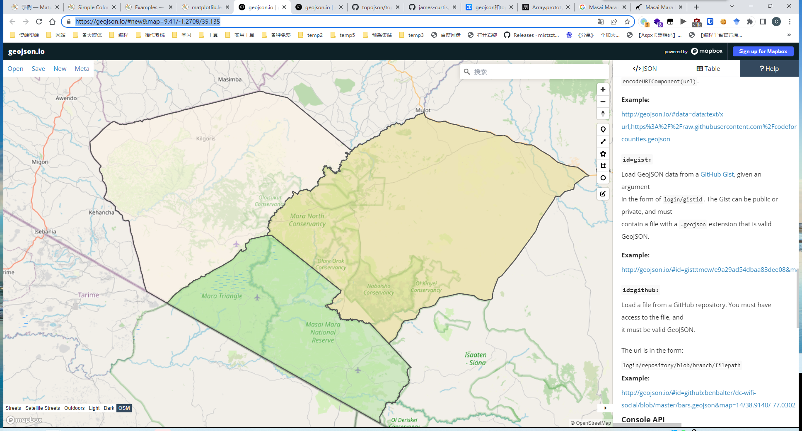

# 区域划分

使用的网站：[geojson.io](geojson.io)

直达链接：[http://geojson.io/#id=github:james-curtis/2022MCM-B/blob/main/Q1/%E5%9B%BE%E7%89%87/%E5%8C%BA%E5%9F%9F%E5%88%92%E5%88%86/map.geojson&map=9.41/-1.2632/35.1459](http://geojson.io/#id=github:james-curtis/2022MCM-B/blob/main/Q1/%E5%9B%BE%E7%89%87/%E5%8C%BA%E5%9F%9F%E5%88%92%E5%88%86/map.geojson&map=9.41/-1.2632/35.1459)