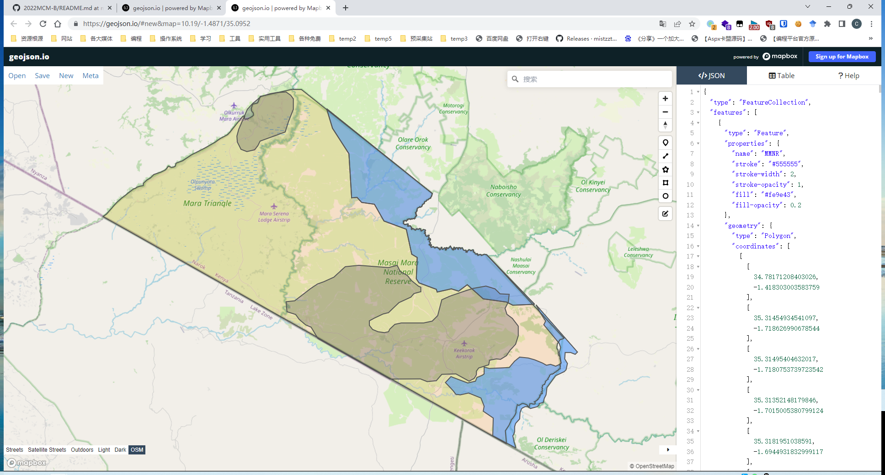

# 区域划分

使用的网站：[geojson.io](geojson.io)

[直达链接](http://geojson.io/#id=github:james-curtis/2022MCM-B/blob/main/Q1/%E5%9B%BE%E7%89%87/%E5%8C%BA%E5%9F%9F%E5%88%92%E5%88%86/map.geojson&map=9.41/-1.2632/35.1459)

# 1971年 牛和犀牛 分布图

**Rhino and cattle distribution in MMNR in 1971/72 (adapted from Mukinya, 1973)**

[直达链接](http://geojson.io/#id=github:james-curtis/2022MCM-B/blob/main/Q1/%E5%9B%BE%E7%89%87/%E5%8C%BA%E5%9F%9F%E5%88%92%E5%88%86/Rhino%20and%20cattle%20distribution%20in%20MMNR%20in%201971%2072%20(adapted%20from%20Mukinya%2C%201973)%20%20.topojson.geojson&map=10.23/-1.4768/35.1012)

# 2000年 牛和犀牛 分布图

**Rhino and cattle distribution in MMNR in 2000**

[直达链接](http://geojson.io/#id=github:james-curtis/2022MCM-B/blob/main/Q1/%E5%9B%BE%E7%89%87/%E5%8C%BA%E5%9F%9F%E5%88%92%E5%88%86/Rhino%20and%20cattle%20distribution%20in%20MMNR%20in%202000.geojson&map=10.23/-1.4768/35.1012)
